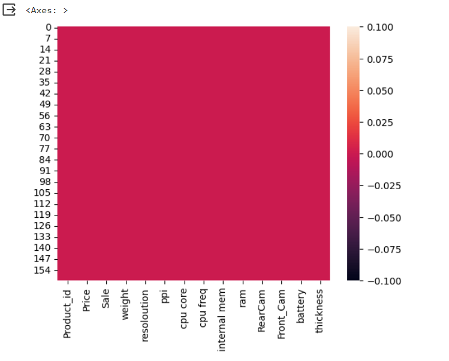
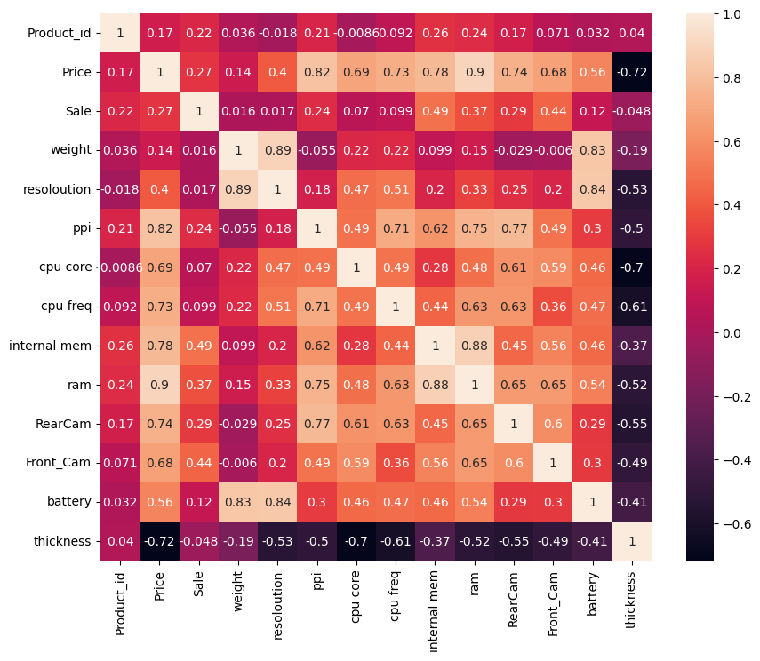
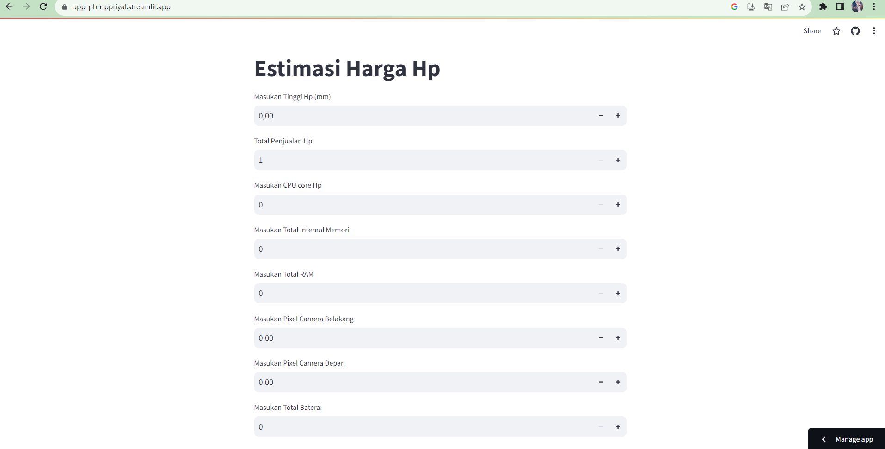

# Laporan Proyek Machine Learning

### Nama : Sultan Muhamad Taufik Mamur

### Nim : 211351142

### Kelas : Pagi B

## Domain Proyek

Dalam konteks proyek estimasi harga hp (handphone atau ponsel), "domain" merujuk pada area atau bidang khusus yang merupakan fokus dari proyek tersebut. Dalam hal ini, domain proyek adalah estimasi harga perangkat ponsel.

Dengan kata lain, proyek ini akan berfokus pada pengembangan metode atau proses yang memungkinkan seseorang atau tim untuk memprediksi atau mengestimasi harga ponsel dengan tingkat ketepatan tertentu dalam mata uang riyal.

## Business Understanding

dalam konteks estimasi harga hp (handphone atau ponsel) merujuk pada pemahaman yang mendalam tentang tujuan dan kebutuhan bisnis yang mendorong kebutuhan untuk melakukan estimasi harga ponsel. 

Ini melibatkan pemahaman tentang mengapa organisasi atau individu tertentu tertarik dalam memahami atau memprediksi harga ponsel dan bagaimana informasi ini akan digunakan dalam konteks bisnis.

dengan begitu individu atau tim bisa menjual belikan hp dari arab ke indonesia dengan harga yang tidak terlalu rendah dan tinggi.

Bagian laporan ini mencakup:

### Problem Statements

Ketidakmungkinan bagi seseorang untuk mengunjungi masing-masing toko Hp  menanyakan harga Hp yang ada di Arab.

### Goals

-memudahkan orang-orang menentuan Harga yang Kompetitif.
-membantu dalam Pengambilan Keputusan Pembelian dan Penjualan.
-membantu penganalisisan Pasar.
-melihat Efisiensi Biaya

### Solution statements

-Pengembangan Platform Pencarian Patokan Harga Apartment Berbasis Web, Solusi pertama adalah mengembangkan platform pencarian harga apartment berbasis web yang mengintegrasikan data dari Kaggle.com untuk memberikan pengguna akses cepat dan mudah ke informasi tentang estimasi harga ponsel di Arab. Platform ini akan menyediakan antarmuka pengguna yang ramah, memungkinkan pengguna mencari harga ponsel berdasarkan kriteria tertentu seperti RAM, ROM, Daya Baterai dan Ukuran ponsel.
- Model yang dihasillkan dari datasets ini menggunakan metode Linear Regression.

## Data Understanding

Dataset yang saya gunakan berasal jadi Kaggle yang berisi harga Ponsel.Dataset ini mengandung 162 baris dan 14 columns.

Selanjutnya menguraikan seluruh variabel atau fitur pada data

### Variabel-variabel pada Global Video Game Sales adalah sebagai berikut:

Product_id    (Menunjukan nomor id Produk)    (int64)
Price         (Menunjukan harga Produk)    (int64)
Sale          (Menunjukan penjualan Produk)    (int64) 
weight        (Menunjukan tinggi Produk)   (float64) 
resoloution   (Menunjukan resolusi Produk)    (float64)
ppi           (Menunjukan Kepadatan Piksel Ponsel)    (int64) 
cpu core      (Menunjukan CPU core Produk)    (int64)
cpu freq      (Menunjukan Frekuensi CPU Produk)    (float64)
internal mem  (Menunjukan ROM Produk)    (float64)
ram           (Menunjukan RAM Produk)    (float64)
RearCam       (Menunjukan kamera belakang Produk)    (float64)
Front_Cam     (Menunjukan kamera depan Produk)    (float64)
battery       (Menunjukan Daya Baterai Produk)    (int64)
thickness     (Menunjukan Ketebalan Produk)    (float64)

## Data Preparation

### Data Collection

Untuk data collection ini, saya mendapatkan dataset yang nantinya digunakan dari website kaggle dengan nama dataset Mobile Price Prediction.

### Data Discovery And Profiling

Untuk bagian ini, kita akan menggunakan teknik EDA. <br>
Pertama kita mengimport semua library yang dibutuhkan dan mendownload token kaggle akun kita,

```bash
import pandas as pd
import numpy as np
import seaborn as sns
import matplotlib.pyplot as plt
from sklearn.model_selection import train_test_split
from sklearn.linear_model import LinearRegression
```

Karena kita menggunakan google colab untuk mengerjakannya maka kita akan import files juga,

```bash
from google.colab import files
```

Lalu mengupload token kaggle agar nanti bisa mendownload sebuah dataset dari kaggle melalui google colab

```bash
file.upload()
```

Setelah mengupload filenya, maka kita akan lanjut dengan membuat sebuah folder untuk menyimpan file kaggle.json yang sudah diupload tadi

```bash
!mkdir -p ~/.kaggle
!cp kaggle.json ~/.kaggle/
!chmod 600 ~/.kaggle/kaggle.json
!ls ~/.kaggle
```

lalu mari kita download datasetsnya

```bash
!kaggle datasets download -d mohannapd/mobile-price-prediction --force
```

Selanjutnya kita harus extract file yang tadi telah didownload

```bash
!mkdir mobile-price-prediction
!unzip mobile-price-prediction.zip -d mobile-price-prediction
!ls mobile-price-prediction
```

Mari lanjut dengan memasukkan file csv yang telah diextract pada sebuah variable, dan melihat 5 data paling atas dari datasetsnya

```bash
df = pd.read_csv("/content/mobile-price-prediction/Cellphone.csv")
df.head()
```

Untuk melihat mengenai type data dari masing masing kolom kita bisa menggunakan property info,

```bash
df.info()
```

Selanjutnya kita akan memeriksa apakah datasetsnya terdapat baris yang kosong atau null dengan menggunakan seaborn,

```bash
sns.heatmap(df.isnull())
```

 <br>

kita deskripsikan dahulu,

```bash
df.describe()
```

Mari kita lanjut dengan data exploration kita,

```bash
plt.figure(figsize=(10,8))
sns.heatmap(df.corr(), annot=True)
```



## Modeling

Langkah pertama adalah memasukkan kolom-kolom fitur yang ada di datasets dan juga kolom targetnya,

```bash
features = ['weight','Sale','cpu core','internal mem','ram','RearCam','Front_Cam','battery','thickness']
x = df[features]
y = df['Price']
x.shape, y.shape
```

Selanjutnya kita akan menentukan berapa persen dari datasets yang akan digunakan untuk test dan untuk train

```bash
x_train, X_test, y_train, y_test = train_test_split(x, y, random_state=70)
y_test.shape
```

lalu membuat mode dan memasukkan X_train dan y_train pada model dan memasukkan value predict pada y_pred,

```bash
lr = LinearRegression()
lr.fit(x_train,y_train)
pred = lr.predict(X_test)
```

sekarang kita bisa melihat score dari model kita,

```bash
score = lr.score(X_test, y_test)
print('akurasi model regresi linier = ', score)
```

Bagus juga, 89%, mari kita test menggunakan sebuah array value

```bash
input_data = np.array([[120,8,2,6,4,10,5,2000,6.7]])
prediction = lr.predict(input_data)
print('Estimasi harga Hp : ', prediction)
```

berhasil!!, sekarang modelnya sudah selesai, mari kita export sebagai sav agar nanti bisa kita gunakan pada project web streamlit kita.

```bash
import pickle

filename = 'Estimasi_Phone_Price.sav'
pickle.dump(lr,open(filename,'wb'))
```

## Evaluation

Disini saya menggunakan F1 score sebagai metrik evaluasi.

F1 Score: F1 score adalah rata-rata harmonis antara presisi dan recall. F1 score memberikan keseimbangan antara presisi dan recall. F1 score dihitung dengan menggunakan rumus: 2*(P*R/P+R)

Setelah itu saya menerapkannya dalam kode menggunakan fungsi f1_score, seperti berikut :

```bash
from sklearn.metrics import precision_recall_curve, f1_score

threshold = 0.5

y_pred_binary = (pred > threshold).astype(int)
y_test_binary = (y_test > threshold).astype(int)

f1 = f1_score(y_test_binary, y_pred_binary)

print('f1 Score :', f1)
```

dan hasil yang saya dapatkan adalah 100%, itu berarti model ini memiliki keseimbangan yang sangat baik antara presisi dan recall.

## Deployment

[My Estimation App](https://app-phn-ppriyal.streamlit.app/).



##
